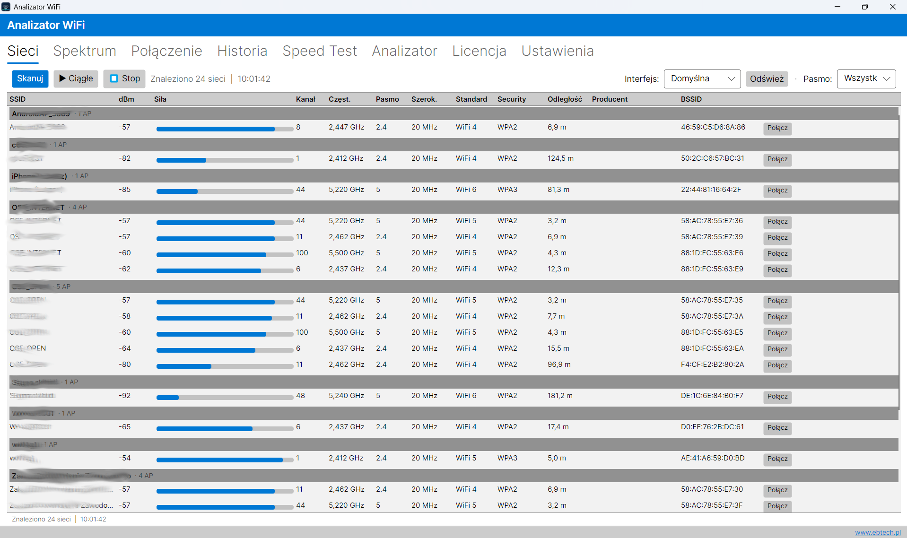
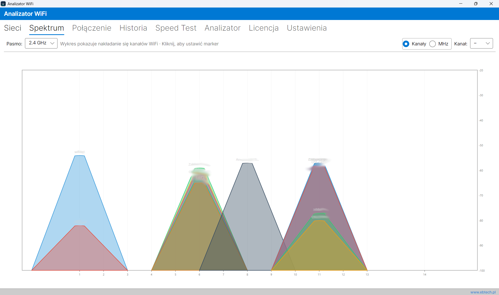
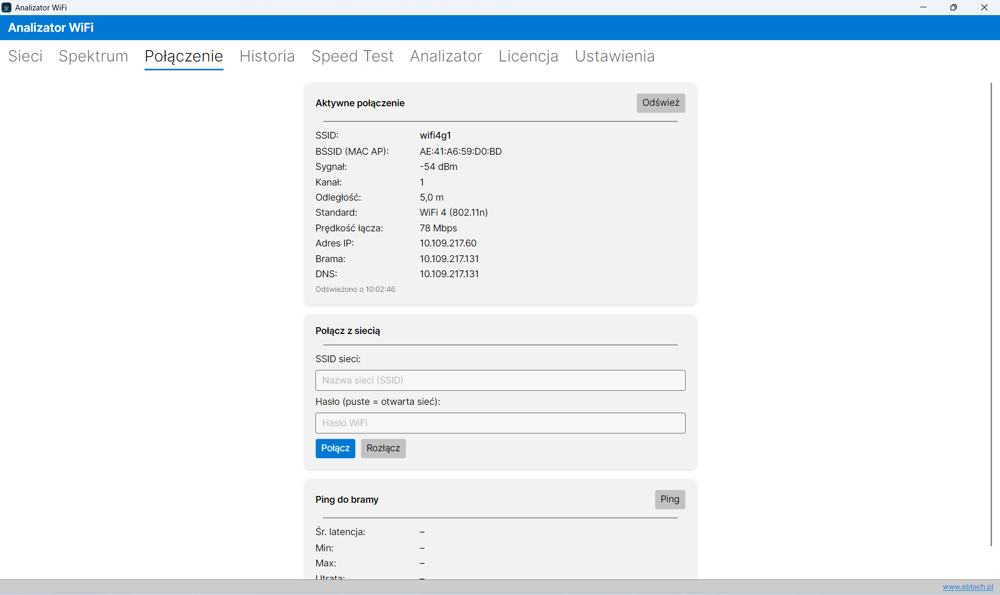
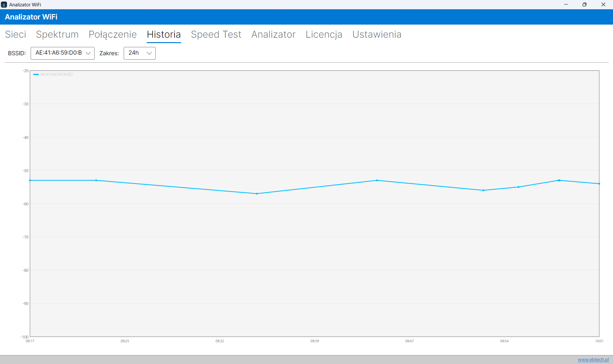
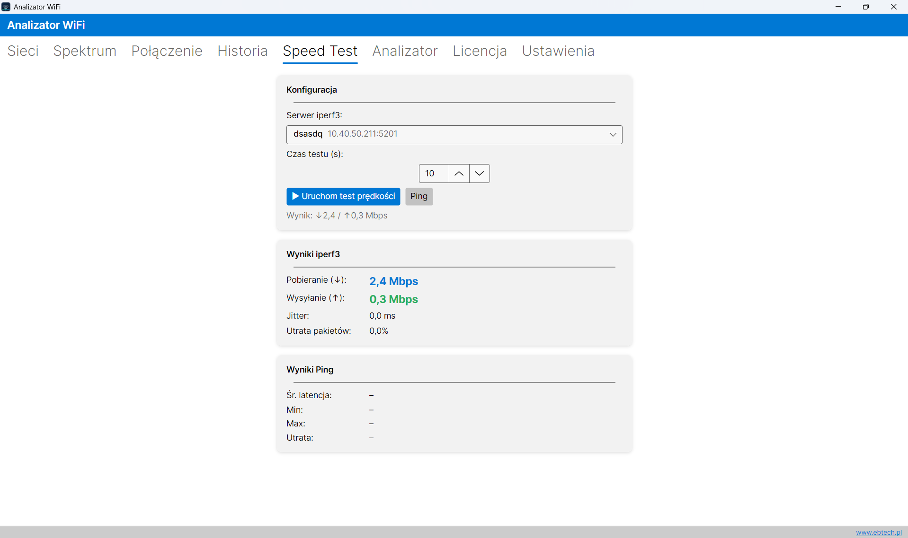
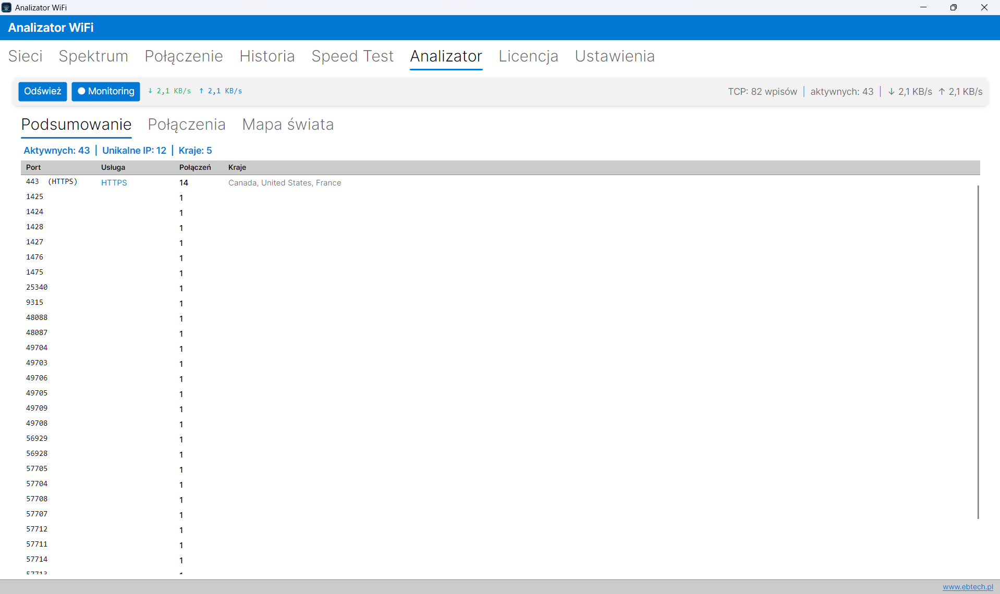
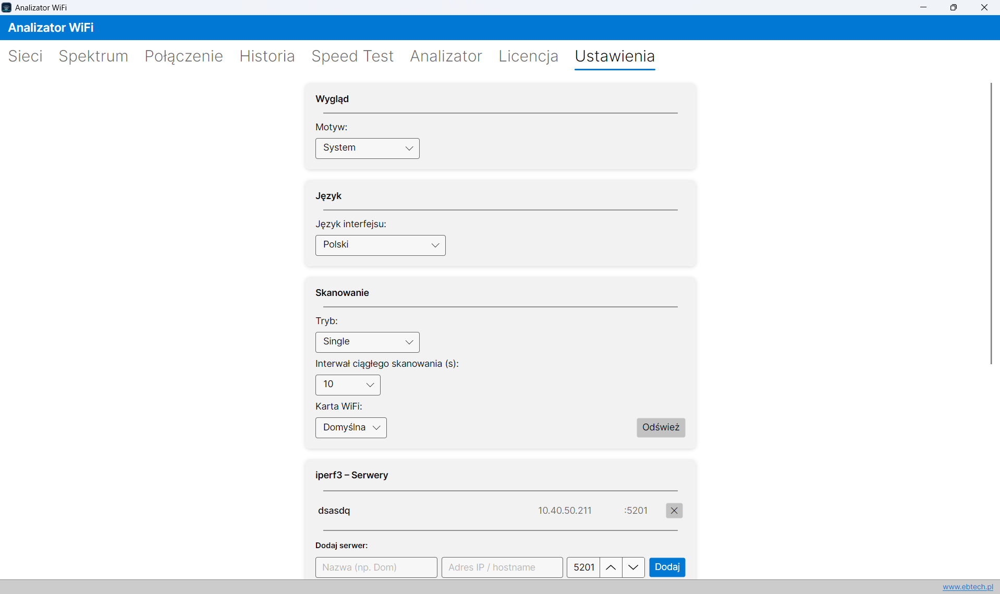

# AnalizatorWiFi

Wieloplatformowa aplikacja desktopowa do analizy sieci WiFi i połączeń sieciowych. Napisana w C# (.NET 9) z interfejsem Avalonia UI, działa na Windows i Linux.

Licencja: MIT
Strona: [ebtech.pl](https://www.ebtech.pl)
Instalator windows: [Setup](https://analizatorwifi.ebtech.pl/soft/AnalizatorWiFi-win-Setup.exe)

## Funkcje

### Sieci WiFi



- Skanowanie dostępnych sieci — jednorazowe lub ciągłe (konfigurowalny interwał)
- Filtrowanie po paśmie: 2.4 GHz / 5 GHz / 6 GHz
- Grupowanie po SSID z widokiem wszystkich punktów dostępowych (BSSID)
- Dla każdej sieci: siła sygnału (dBm i %), kanał, szerokość kanału, standard (802.11b/g/n / WiFi 4/5/6/7), zabezpieczenia (WEP/WPA/WPA2/WPA3/Enterprise), szacunkowa odległość, producent karty (OUI)
- **Wybór interfejsu WiFi** bezpośrednio z paska narzędzi — skanowanie i łączenie używa wybranej karty; wybór zapisywany automatycznie

### Widmo kanałów



- Wizualizacja zajętości kanałów dla każdego pasma
- Kolorowy wykres nakładania się sieci na osi częstotliwości
- **Przełącznik osi X**: tryb kanałów (numery w rzeczywistych pozycjach MHz) lub tryb MHz (wartości częstotliwości)
- **Interaktywny marker**: kliknięcie na wykresie stawia złotą linię z etykietą kanału i częstotliwości; pasek stanu pokazuje numer kanału, częstotliwość oraz które sieci są w zasięgu
- Wybór kanału z listy (2.4 GHz: 1–14, 5 GHz: 25 kanałów UNII, 6 GHz: 24 kanały) automatycznie przesuwa marker na środek częstotliwości tego kanału

### Aktualne połączenie



- Szczegóły bieżącej sesji: SSID, BSSID, IP, brama, DNS, prędkość łącza, sygnał, kanał, standard
- Szacunkowa odległość od routera na podstawie poziomu sygnału
- Łączenie i rozłączanie z sieciami, ping do bramy
- Operacje wykonywane na wybranym interfejsie WiFi (spójne z wyborem w zakładce Sieci)

### Historia sygnału



- Wykresy zmian siły sygnału wybranych BSSID w czasie
- Zakresy: 1h / 6h / 24h / 7d / 30d
- Dane przechowywane lokalnie w bazie SQLite

### Test prędkości



- Pomiar download/upload za pomocą **iperf3**
- Wyniki: przepustowość (Mbps), jitter (ms), utrata pakietów (%)
- Test ping z pełnymi statystykami (avg/min/max/utrata)
- Obsługa wielu serwerów iperf3 konfigurowanych w ustawieniach

### Analizator połączeń TCP



- Monitorowanie aktywnych połączeń TCP w czasie rzeczywistym (odświeżanie co 3 s)
- Geolokalizacja zdalnych adresów IP z mapą świata
- Podsumowanie po portach (top 40) z nazwami usług
- Bieżąca prędkość pobierania/wysyłania na poziomie interfejsów sieciowych
- Filtrowanie listy połączeń po adresie, kraju, usłudze lub stanie

### Ustawienia



- Motyw: systemowy / jasny / ciemny
- Tryb skanowania i interwał
- Język interfejsu (pl, en, de, fr, es, it, ru, cs, uk)
- Konfiguracja serwerów iperf3
- Alert sygnałowy (próg dBm)
- Wybór adaptera sieciowego (trwale zapisywany; można też zmienić z poziomu zakładki Sieci)

## Wymagania

- [.NET 9 SDK](https://dotnet.microsoft.com/download/dotnet/9.0)
- **Windows**: brak dodatkowych wymagań (korzysta z natywnego WLAN API)
- **Linux**: zainstaluj wymagane pakiety systemowe skryptem:
  ```bash
  sudo ./install-deps-linux.sh
  ```
  Skrypt obsługuje Debian/Ubuntu, Fedorę/RHEL i Arch Linuksa. Instaluje `network-manager` (nmcli), `iperf3`, biblioteki X11/OpenGL/Wayland wymagane przez Avalonia UI oraz włącza usługę NetworkManager.
- **Test prędkości**: opcjonalnie `iperf3` zainstalowany w systemie (instalowany przez powyższy skrypt)

## Struktura projektu

```
src/
├── AnalizatorWiFi.Core/             # Modele, interfejsy, serwisy niezależne od platformy
├── AnalizatorWiFi.Platform.Windows/ # Implementacja WLAN API (Windows)
├── AnalizatorWiFi.Platform.Linux/   # Implementacja przez powłokę (Linux)
└── AnalizatorWiFi.UI/               # Aplikacja Avalonia UI (MVVM)
```

## Kompilacja

### Szybki start (debug)

```bash
dotnet build src/AnalizatorWiFi.UI/AnalizatorWiFi.UI.csproj
dotnet run --project src/AnalizatorWiFi.UI/AnalizatorWiFi.UI.csproj
```

### Publikacja — Windows (samodzielny .exe)

```bash
dotnet publish src/AnalizatorWiFi.UI/AnalizatorWiFi.UI.csproj ^
  -c Release -r win-x64 --self-contained ^
  -o publish/win-x64
```

### Publikacja — Linux (samodzielny plik wykonywalny)

```bash
dotnet publish src/AnalizatorWiFi.UI/AnalizatorWiFi.UI.csproj \
  -c Release -r linux-x64 --self-contained \
  -o publish/linux-x64
chmod +x publish/linux-x64/AnalizatorWiFi.UI
```

### Publikacja bez osadzania środowiska uruchomieniowego

```bash
dotnet publish src/AnalizatorWiFi.UI/AnalizatorWiFi.UI.csproj \
  -c Release -o publish/portable
```

## Użyte technologie

| Biblioteka | Wersja | Rola |
|---|---|---|
| Avalonia UI | 12.0.4 | Wieloplatformowy interfejs graficzny |
| CommunityToolkit.Mvvm | 8.4.1 | MVVM, komendy, source generators |
| Microsoft.Extensions.Hosting | 